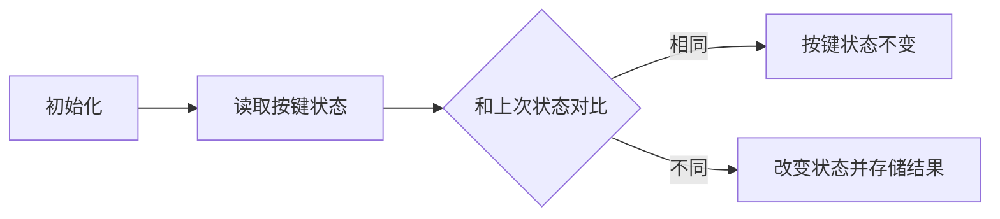

# C51单片机

​      单片机最重要的是看原理图，理解原理。

​				**1：高电平    0：低电平**

## <font face = "思源宋体"><font sizz = "7"><font color = 0xffab12>目录</font></font></font>

[TOC]

## C语言基础

### 01 数据类型

### 02 选择语句

### 03 循环语句

### 04 其他

#### 4.1 数组

## 基础技能

### 01 led灯

### 02 数码管

#### 2.1 基本认识

此次学习的数码管为**led数码管**（由多个发光二极管封装在一起组成“8”字型的器件），有公共电极。

组成“8”字型的二极管用**段**计量，加上小数点共有8段，分别用`a、b、c、d、e、f、g、h、dp`表示，想让哪一段亮就改变哪一段的电平。

- 数码管的类型

倒二个字母：A ---- 共阴  B ---- 共阳

共阴共阳的不同会导致数码管段选的表示不同

##### 附表（1）

(共阳无小数点)

|      | h    | g    | f    | e    | d    | c    | b    | a    |      |
| :--: | ---- | ---- | ---- | ---- | ---- | ---- | ---- | ---- | ---- |
|  0   | 1    | 1    | 0    | 0    | 0    | 0    | 0    | 0    | 0xc0 |
|  1   | 1    | 1    | 1    | 1    | 1    | 0    | 0    | 1    | 0xf9 |
|  2   | 1    | 0    | 1    | 0    | 0    | 1    | 0    | 0    | 0xa4 |
|  3   | 1    | 0    | 1    | 1    | 0    | 0    | 0    | 0    | 0xb0 |
|  4   | 1    | 0    | 0    | 1    | 1    | 0    | 0    | 1    | 0x99 |
|  5   | 1    | 0    | 0    | 1    | 0    | 0    | 1    | 0    | 0x92 |
|  6   | 1    | 0    | 0    | 0    | 0    | 0    | 1    | 0    | 0x82 |
|  7   | 1    | 1    | 1    | 1    | 1    | 0    | 0    | 0    | 0xf8 |
|  8   | 1    | 0    | 0    | 0    | 0    | 0    | 0    | 0    | 0x80 |
|  9   | 1    | 0    | 0    | 1    | 0    | 0    | 0    | 0    | 0x90 |
|  a   | 1    | 0    | 0    | 0    | 1    | 0    | 0    | 0    | 0x88 |
|  b   | 1    | 0    | 0    | 0    | 0    | 0    | 1    | 1    | 0x83 |
|  c   | 1    | 1    | 0    | 0    | 0    | 1    | 1    | 0    | 0xc6 |
|  d   | 1    | 0    | 0    | 1    | 0    | 0    | 0    | 1    | 0xa1 |
|  e   | 1    | 0    | 0    | 0    | 0    | 1    | 1    | 0    | 0x86 |
|  f   | 1    | 0    | 0    | 0    | 1    | 1    | 1    | 0    | 0x8e |
|  -   | 1    | 0    | 1    | 1    | 1    | 1    | 1    | 1    | 0xbf |

##### 附表（2）

|            | 无小数点                                                     | 有小数点                                                     |
| ---------- | ------------------------------------------------------------ | ------------------------------------------------------------ |
| 共阳数码管 | 0xc0,0xf9,0xa4,0xb0,0x99, 0x92,0x82,0xf8,0x80,0x90, 0x88,0x83,0xc6,0xa1,0x86,0x8e,0xbf | 0x40,0x79,0x24,0x30, 0x19,0x12,0x02,0x78 0x00,0x10,0x08,0x03,0x46,0x21,0x06,0x0e,0x3f |
| 共阴数码管 | 0x3f,0x06,0x5b,0x4f,0x66, 0x6d,0x7d,0x07,0x7f,0x6f, 0x77,0x7c,0x39,0x5e,0x79,0x71 | 0xbf,0x86,0xdb,0xcf,0xe6 0xed,0xfd,0x87,0xff,0x6f, 0xf7,0xfc,0xb9,0xde,0xf9,0xf1 |

- 共阳：无小数前四位 ==-8== 有小数点
- 共阴：无小数点前四位==+8==有小数点

==共阳数码管（无小数）==：`unsigned char code smg[]={0xc0,0xf9,0xa4,0xb0,0x99, 0x92,0x82,0xf8,0x80,0x90, 0x88,0x83,0xc6,0xa1,0x86,0x8e,0xbf}`

==共阴数码管（无小数）==：`unsigned char code smg[]={0x3f,0x06,0x5b,0x4f,0x66, 0x6d,0x7d,0x07,0x7f,0x6f, 0x77,0x7c,0x39,0x5e,0x79,0x71}`

==共阳数码管（有小数）==：`unsigned char code smg[] = {0x40,0x79,0x24,0x30, 0x19,0x12,0x02,0x78 ,0x00,0x10,0x08,0x03,0x46,0x21,0x06,0x0e,0x3f}`

==共阴数码管（有小数）==：`unsigned char code smg[] = {0xbf,0x86,0xdb,0xcf,0xe6 0xed,0xfd,0x87,0xff,0x6f, 0xf7,0xfc,0xb9,0xde,0xf9,0xf1}`

#### 2.2 静态显示

> 定义：每个数码管的每一个段码都由一个I/O口进行驱动
>
> 优点：编程简单，亮度高
>
> 缺点：占I/O口多

```c
#include"reg52.h"

unsigned char code SMG_D[18] =
    {0xc0,0xf9,0xa4,0xb0,0x99,0x92,0x82,0xf8,
     0x80,0x90,0x88,0x80,0xc6,0xc0,0x86,0x8e,
     0xbf,0x7f};

		 
void delay(unsigned int t)//延时函数
{
		while(t--);
		while(t--);
}

void Show_bit(unsigned char value,unsigned char pos)
{
   P2 = (P2 & 0x1f)| 0xc0;P0 = 0x01 << pos;P2 &= 0x1f;
	 P2 = (P2 & 0x1f)| 0xe0;P0 = value;P2 &= 0x1f;
}
//0xc0选中时对应了位
//0xe0对应段的选择

void static_show()
{
     char i,j;
		 for(i = 0;i < 8;i++)
		 {
				for(j = 0;j < 10;j++)
			 {
			   Show_bit(SMG_D[j],i);
				 delay(60000);
			 }
		 }
		 
		 P2 = P2 & 0x1f | 0xc0;P0 = 0xff;P2 &= 0x1f;
		 
		 for(i = 0;i < 16;i++)
		 {
			 P2 = P2 & 0x1f | 0xe0;P0 = SMG_D[i];P2 &= 0x1f;
			 delay(60000);
		 }
}	//代码来自：https://bbs.21ic.com/icview-2409312-1-1.html

void main()
{
		P2 = P2 & 0x1f | 0xa0;P0 = 0;P2 &= 0x1f;
    while(1)
		{
			static_show();
		}
}
```

**静态显示只能<font color = #FF0000>一位一位</font>显示或者所有位显示<font color = #FF000>同个</font>数字/字母**

#### 2.3 动态显示

> 动态驱动是将所有数码管的8个显示笔划"a,b,c,d,e,f,g,dp"的同名端连在一起，另外为每个数码管的公共极COM增加位选通控制电路，位选通由各自独立的I/O线控制.
>
> 在轮流显示过程中，每位数码管的点亮时间为1～2ms，由于人的视觉暂留现象及发光二极管的余辉效应，尽管实际上各位数码管并非同时点亮，但只要扫描的速度足够快，给人的印象就是一组稳定的显示数据，不会有闪烁感，动态显示的效果和静态显示是一样的，能够节省大量的I/O端口，而且功耗更低。
>
> （引自百度百科）

```c
//相比于静态显示，动态显示只需要每个位置都显示，且延时时间缩短
void Dynamic_Show()
{
 	Show_bit(SMG_D[0],0);//在第0位显示0
	delay(500);
	Show_bit(0xff,0);//消隐   
    //如果有消隐的话
}
```

主程序中：

```c
void main()
{
    Dynamic_show()；
    delaySMG(500);//增加一个延时
}
```

其中，`delaySMG(500);`所对应函数为：

```c
void delaySMG(unsigned int t)
{
    while(t--)
    {
        Dynamic_Show();
    }
}//注意：此刻delay应写成：
/*
void delay(unsigned int t)
{
	while(t--);
}
//需要比原来的少一个t-- 即delay和delaySMG的延时时间应该相同
*/
```

==**改进版**==

```c
void Dynamic_show()
{
    unsigned char pos;
    for(pos = 0;pos < 8;pos++)
    {
       P2 = (P2 & 0x1f)|0xc0;P0 = 0x01 << pos;P2 &= 0x1f; 
       P2 = (P2 & 0X1f)|0xe0;P0 = SMG_D[table[i]];P2 & 0x1f;
       delay(500);//记得延时
    }
//巧用table[] table[]里面存放各个位置对应的数字/字母
}
```

#### 2.4 静态显示和动态显示区别

其实……~~没有区别~~

也不是说没有，两者之间的代码相似度很高，只是静态只选择一位或一个数字，动态把所有位都一起控制了。

### 03 独立按键

KBD 矩阵按键

BTN 独立按键

#### 3.1 独立按键

```c
void ReadKey()
{
    if(S7 == 0)
    {
        delay(100);
        while(S7 == 0) ;
        //S7进行操作
    }
}
```

按键按下不是直接0-1的跳跃，而是中间还有其他状态：0-x-1 x的时间约为**10ms**


#### 3.2 三行写法


```c
	unsigned char ReadData,trg,cont;
	void scanfKey()
    {
        ReadData = P3 ^ 0XFF;
        trg = ReadData & (ReadData ^ cont);//对比上一次结果，获取哪一个按键被按下
        //没变的话：trg为0 则不会改变
        cont = ReadData;//存储上一次按下的按键值
    }
```

```c
	if(trg & 0x01) // 短按键
    if(cont & 0x01)//长按键
    {
        time_count++;
        if(time_count == 100)
        {
            time_count = 0;
            //其他操作
        }
    }
```


#### 3.3 状态机思想

定义多种状态，每隔一段时间检测一次，查看按键处于哪种状态

所需设定：

当前按键状态并读入

上次按键状态及存取

对比上次按键状态和当前按键状态并存储结果

**流程图为：**



```c
#include"reg52.h"
#define KEY P3
#define KEY0 0  //判断是否按下
#define KEY1 1  //判断是否抖动
#define KEY2 2 //判断是否弹起
#define key_mask 0x0f//屏蔽不需要的IO

char ReadKey(void)
{
    static char key_tate = 0;//定义为static 1-会自动初始化为0，避免忘记初始化 2-该函数运行完后key_state不会被销毁，直到本程序运行完毕
    
    char key_press,key_return = 0;//key_press为存储的按压状态，等于：读入状态 & 上一次按键状态，即key_press的作用在于记录按键状态是否改变
    
    key_press = KEY & key_mask;//先进行一次判断
    
    switch(key_state)
    {
        case KEY0://之前是未按下状态
            if(key_press != key_mask) key_state = 1;//如果现在按下了，则将按键状态记为按下
            break;
        case KEY1:
            if(key_press == (KEY & key_mask))//已经按下了，且目前正在按
            {
                if(key_press == 0x0e) key_return = 1;//通过key_press的十六进制值判断按下独立按键的哪个按键，并获得一个返回值
                if(key_press == 0x0d) key_return = 2;
                if(key_press == 0x0b) key_return = 3;
                if(key_press == 0x07) key_return = 4;
                key_state = KEY2;//将按键状态改为抬起中
            }
            else
            {
                key_state = KEY0;//表示此时正在抖动时期，所以不改变按键状态
            }
            break;
        case KEY2://如果按键在抬起，那么抬起之后就是松开，则按键状态恢复到松开
            if(key_state == 0x0f) key_state = KEY0;
            break;
    }
    return key_return;
}
```

### 04 矩阵键盘

#### 4.1 矩阵键盘

==**扫描思想**==（待验证）

高四位 - 行扫描

低四位 - 列扫描

行列中有一种先赋值为高电平 通过读取低电平判断哪个按键按下

|        |  C1  |  C2  |  C3  |  C4  |
| :----: | :--: | :--: | :--: | :--: |
| **R1** |      |      |      |      |
| **R2** |      |      |      |      |
| **R3** |      |      |      |      |
| **R4** |      |      |      |      |

```c
	sfr P4 = 0XC0;
	//定义行
	sbit R1 = P3 ^ 0;
	sbit R2 = P3 ^ 1;
    sbit R3 = P3 ^ 2;
    sbit R4 = P3 ^ 3;
    //定义列    
    sbit C1 = P4 ^ 4;
    sbit C2 = P4 ^ 5;   
    sbit C3 = P3 ^ 4;
    sbit C4 = P3 ^ 5;

void Keyscanf()
{
    R1 = 0;
    R2 = R3 = R4 = 1;
    C1 = C2 = C3 = C4 = 1;
    if(C1 == 0)
    {
        while(C1 == 0);//消抖
     //按下R1C1的操作
    }
}
```

#### 4.2 状态机思想在矩阵键盘的应用


```c
#define KEY P3
#define key_state_0 0
#define key_state_1 1
#define key_state_2 2

char read_KBD()
{
    static char key_state = 0;
    unsigned char key_return  = 0,key_press;
    unsigned char  key1,key2;
    
    KEY = 0xf0;
    key1 = KEY & 0xf0;
    KEY = 0x0f;
    key2 = KEY & 0x0f;
    key_press = key1 | key2;
    switch(key_state)
    {
        case key_sate_0:
            if(key_press != 0xff) key_state = key_state_1;
            break;
        case key_state_1:
            if(key_press != 0xff)
            {
                if(key_press == 0xde) key_return = 1;
                if(key_press == 0xdd) key_return = 2;
                key_state = key_state_2;
            }
            else
                key_state = key_state_0;
            break;
        case key_state_2:
            if(key_press == 0xff) key_state = key_state_0;
            break;
    }
    return key_return;
}
```


### 05 蜂鸣器与继电器


## 进阶技能

### 01 中断

### 02 定时器

### 03 PWM脉宽调制信号

### 04 串口通信

#### 4.1 定义

>  串口通信：[串行接口](https://baike.baidu.com/item/串行接口/2909564)是一种可以将接收来自[CPU](https://baike.baidu.com/item/CPU)的[并行](https://baike.baidu.com/item/并行/33188)数据字符转换为连续的串行数据流发送出去，同时可将接收的串行[数据流](https://baike.baidu.com/item/数据流/3002243)转换为并行的数据字符供给CPU的器件。一般完成这种功能的[电路](https://baike.baidu.com/item/电路/33197)，我们称为串行接口电路。
>
> 串口通信（Serial Communications）的概念非常简单，串口按位（bit）发送和接收[字节](https://baike.baidu.com/item/字节/1096318)的[通信方式](https://baike.baidu.com/item/通信方式/4535155)。

==**注意**==

- 数据**一位接一位地顺序**发送或接收
- 有SPI、IIC、UART等多种，最常见最通用的是指**UART**
- 制式有：**单工**、**半双**工、**全双工**


```c
sfr AUXR = 0x8e;

unsigned char tmpRecv;

void Init_Uart()
{
    TMOD = 0x20;
    TH1 = 0xfd;
    TL1 = 0xfd;
    AUXR = 0X00;
    TR1 = 1;
    SCON = 0X50;
    ES = 1;
    EA = 1;
}

void SendByte(unsigned char dat)
{
    SBUF = dat;
    while(T1 == 0);
    T1 = 0;
}

void Service_Uart() interrupt 4
{
    if(RI == 1)
    {
        RI == 0;
        tmpRecv = SBUF;
        SendByte(tmpRecv + 1);
    }
}
```

### 05 IO扩展技术

## 其他操作

### 01 DS18B20

#### 1.1 定义

> 数字温度传感器，有<font color = #FF0000>体积小，硬件开销低，抗干扰能力强，精度高</font>的特点。<sub>(源自百度百科)</sub>

#### 1.2 工作原理

低温度系数晶振振荡频率受温度影响很小，用于产生固定频率的脉冲信号发送给计数器1。

高温度系数晶振随温度变化其振荡频率明显改变，所产生的信号作为计数器2的脉冲输入。

计数器1和温度寄存器被预置在**-55℃**所对应的一个基数值。

计数器1对低温度系数晶振产生的脉冲信号进行减法计数，当计数器1的预置值减到0时，温度寄存器的值将加1，计数器1的预置将重新被装入，计数器1重新开始对低温度系数晶振产生的脉冲信号进行计数。

如此循环直到计数器2计数到0时，停止温度寄存器值的累加，此时温度寄存器中的数值即为所测温度。

斜率累加器用于补偿和修正测温过程中的非线性，其输出用于修正计数器1的预置值。

#### 1.3 性能描述

| 性能描述                                                     |
| :----------------------------------------------------------- |
| <font face = "楷体">DS18B20在与微处理器连接时仅需要**一条口线**即可实现微处理器与DS18B20的双向通讯</font> |
| <font face = "楷体">测温范围 <font color = #FF0000>－55℃～+125℃</font>，固有测温误差<font color=#FF0000>1℃</font>。</font> |
| <font face = "楷体">工作电源: 3.0~5.5V/DC （可以数据线寄生电源）</font> |
| <font face = "楷体">支持多点组网功能，多个DS18B20可以并联在唯一的三线上，最多只能并联8个，实现多点测温，如果数量过多，会使供电电源电压过低，从而造成信号传输的不稳定。</font> |
| <font face = "楷体">在使用中不需要任何外围元件</font>        |
| <font face = "楷体">~~不锈钢保护管直径 Φ6~~</font>           |
| <font face = "楷体">~~适用于DN15~25, DN40~DN250各种介质工业管道和狭小空间设备测温~~</font> |
| <font face = "楷体">~~标准安装螺纹 M10X1, M12X1.5, G1/2”任选~~</font> |
| <font face = "楷体">~~PVC电缆直接出线或德式球型接线盒出线,便于与其它电器设备连接。~~</font> |

#### 1.4 控制方法

DQ为数字信号输入/输出端

开始时需要先定义DQ

```c
sbit DQ = P1 ^ 4;
```

- 初始化

  >     (1） 先将数据线置高电平“1”。
  >
  > （2） 延时（该时间要求的不是很严格，但是尽可能的短一点）
  >
  > （3） 数据线拉到低电平“0”。
  >
  > （4） 延时750微秒（该时间的时间范围可以从480到960微秒）。
  >
  > （5） 数据线拉到高电平“1”。
  >
  > （6） 延时等待（如果初始化成功则在15到60微秒时间之内产生一个由DS18B20所返回的低电平“0”。据该状态可以来确定它的存在，但是应注意不能无限的进行等待，不然会使程序进入死循环，所以要进行超时控制）。
  >
  > （7） 若CPU读到了数据线上的低电平“0”后，还要做延时，其延时的时间从发出的高电平算起（第（5）步的时间算起）最少要480微秒。
  >
  > （8） 将数据线再次拉高到高电平“1”后结束。

  ```c
  bit Init_DS18B20()
  {
      bit initflag = 0;
      
      DQ = 1;
      delay(12);
      DQ = 0;
      delay(80);
      DQ = 1;
      delay(10);
      initflag = DQ;
      delay(5);
      
      return initflag;
  }
  ```

  

- 写操作

  >（1） 数据线先置低电平“0”。
  >
  >（2） 延时确定的时间为15微秒。
  >
  >（3） 按从低位到高位的顺序发送字节（一次只发送一位）。
  >
  >（4） 延时时间为45微秒。
  >
  >（5） 将数据线拉到高电平。
  >
  >（6） 重复上（1）到（6）的操作直到所有的字节全部发送完为止。
  >
  >（7） 最后将数据线拉高。

  ```c
  void Write_temperature(unsigned char dat)
  {
      unsigned char i;
      for(i = 0;i < 8;i++)
      {
          DQ = 0;
          DQ = dat & 0x01;//写给数据最低位;
          delay(5);//延时
          DQ = 1;//给脉冲
          dat >>= 1;//数据移位
      }
  	delay(5);
  }
  ```
- 读操作

  >（1）将数据线拉高“1”。
  >
  >（2）延时2微秒。
  >
  >（3）将数据线拉低“0”。
  >
  >（4）延时3微秒。
  >
  >（5）将数据线拉高“1”。
  >
  >（6）延时5微秒。
  >
  >（7）读数据线的状态得到1个状态位，并进行数据处理。
  >
  >（8）延时60微秒。

  ```c
   unsigned char Read_temperature()
    {
        unsigned char i;
        unsigned dat = 0;
        for(i = 0;i < 8;i++)
        {
            DQ = 0;
            dat >>= 1;
            DQ = 1;
            if(DQ)
            {
                dat |= 0x80;
            }
            delay(5);
        }
       return dat;
    }
  ```

#### 1.5 应用代码

>- 初始化
>- 跳过ROM指令
>- 温度转化
>- 恢复初始化
>- 跳过ROM指令
>- 读高速缓存器
>- 读LSB MSB
>- 复位，暂停读数
>- 数据转化
>

  ```c
  void ReadOnewire()
  {
      unsigned char LSB,MSB;
      Init_DS18B20();//初始化
      Write_temperature(0xcc);//跳过ROM指令
      Write_temperature(0x44);//开始温度转化
      Init_DS18B20();//恢复初始化
      Write_temperature(0xcc);//跳过ROM指令
      Write_temperature(0xbe);//读取高速缓存器
      LSB = Read_temperature();//读低八位
      MSB = Read_temperature();//读高八位
      Init_DS18B20();//复位 暂停读数
	  T_dat = MSB;//T_dat = 0x0000
      T_dat <<= 8;
      T_dat |= LSB;//MSB+MLB 获得一个十进制温度
      if((T_dat & 0xf800) == 0x0000)//T_dat为正
      {
          T_dat >>= 4;//取出温度的整数部分
          T_dat = T_dat * 10;
          T_dat = T_dat + (LSB & 0x0f) * 0.625;
      }
  }
  ```

  >**注意**
  >
  >T_dat > 0  (LSB + MSB) * 0.0625
  >
  >T_dat < 0 (~(LSB + MSB) + 1) * 0.0625

  #### 1.6 延时程序

  ```c
  void delay(unsigned int t)
  {
      while(t--);
  }
  /*
  具体延时时间看汇编
  
  C：0x000F
  7F0A
  MOV R7,#0X0A
  */
  ```

#### 1.7 ==注意事项==

- 读操作有返回值
- 延时的时间很重要
- 应用的时候T_dat不是char而是int

### 02 DS1302


### 03 555定时器

### 04 超声波测距

**所用芯片：**CX20106A

**原理：**当CX20106A接收到40kHZ信号时，在第7脚产生一个低电平下降脉冲

**特点：**具有很高的灵敏度和抗干扰能力

==**注意事项：**==

- 确定超声波发出的频率为40kHZ，保障有足够驱动力电压
- 开放式防水探头，反相器串联再并联做BTL推动。（短距离 10Vpp以上即可）

​       【Vpp指交流或脉冲信号的最低值到最高值的电压，也称为峰峰值】

​		全封闭防水头，60Vpp以上 中周变压器

- 第5脚决定接收的中心频率，200千欧电阻决定40kHZ

###### 程序

```c
#include"reg52.h"

sbit TX = P3 ^ 0;//发射引脚
sbit RX = P3 ^ 1;//接收引脚

void Init_Timer0()
{
    AXUR &= 0x7F;
    TMOD &= 0xF0;//1111  C/T = 1,计数模式 M1 M0 = 11，此刻T0分为两个独立计数，存在TH0 和 TL0中
    TH0 = 0XF4;
    TL0 = 0XFF;
    TF0 = 0;//T0溢出中断请求标志，为0 无中断请求
    TR0 = 0;//T0暂停计时
}

unsigned char Wave_Recv()//超声波测距 发射与返回 获得的路程/2 时间/2
{
    unsigned char ucDist,ucNum = 10;//Dist  距离
    
    TX = 0;//
    TH0 = 0XF4;
    TL0 = 0XFF;
    TR0 = 1;//开始计时
    
    while(ucNum--)
    {
     	while(!TF0);
        TX ^= 1;
        TF0 = 0;
    }
    
    TR0 = 0;
    TL0 = 0;
    TH0 = 0;
    TR0 = 1;
    
    while(!TF0 && RX);
    TR0 = 0;
    if(TF0)
    {
        TF0 = 0;
        ucDist = 255;
    }
    else
    {
        ucDist = ((TH0 << 8) + TL0) * 0.017; 
    }
    return ucDist;
}
```


### 05 EEPROM

### 06 PCF8591 ADC/DAC

### 07 频率测量设计

**定时器0**初始化为计数器模式，对P34（T0）进行脉冲计数

==注意==

频率测量J3 - J5 与J3 - J6短接

```c
#include"reg52.h"//待补充

//d定义p34,待补充
sbit p34 = 

void Init_Timer0()
{
    TMOD = 0XD0;
    TR = 1;
}

void Delay(unsigned int t)
{
    while(t--);
}

void Service01() interrput 0
{
    //通过判断p34的电平来获取脉冲个数
    
}

void main()
{
    while(1)
    {
        Init_Timer0();
    }
}
```


### 08 模块化编程

> 头文件作为一种包含功能函数、数据接口声明的**载体文件**，主要用于保存程序的声明，而定义文件**用于保存程序的实现**。(源自百度百科)

主要用于通用的 多用的的功能，即对外提供一些并不需要怎么操作只需要直到功能的文件。

需要有`.c`和`.h`配套的文件

​	**.h**文件为头文件，一般由四部分构成

- 头文件开头处的版权和版本声明
-  预处理块
- inline函数的定义
- 函数和类结构声明等

```c
#ifndef //宏定义名称
#define //宏定义名称
/*
 	…
 	函数主体
 */
#endif
```

这样写的好处是<font color = #80080>可以防止重复定义</font>。

写完后要把`.h`和`.c`文件一起导入工程里。

比如 独立键盘的和数码管显示就可以用模块化


